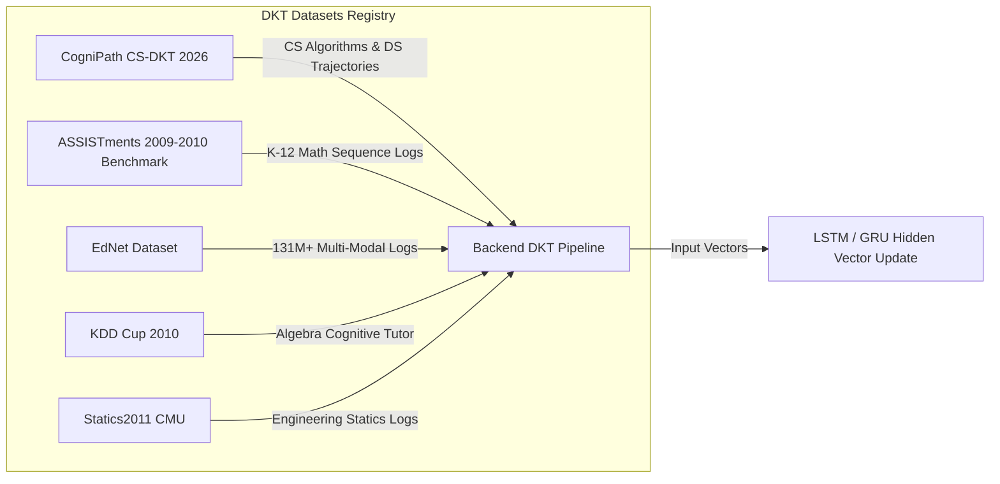

# CogniPath AI - Adaptive Student Learning & Recommendation System

> **An Adaptive Deep Learning-Based Student Learning & Recommendation Engine** utilizing Deep Knowledge Tracing (DKT), sequence modeling (LSTM/GRU), cognitive mastery estimation, and automated spaced-repetition revision.

---

## 👥 Project Team & Domain Details

- **Project Domain**: Deep Learning, Adaptive Learning, Knowledge Tracing, Intelligent Tutoring Systems
- **Target Objective**: Build an AI learning system that understands each student's changing progress and updates their personalized learning trajectory in real-time.

### Team Members
| Name | Register Number | Role |
| :--- | :--- | :--- |
| **Chirag Pradhan** | `24BCE7237` | Lead Developer & AI System Architect |
| **Darga Syed Javid** | `24BCA7689` | Deep Learning & Sequence Modeling |
| **Shaik Mansoor** | `24BCA7204` | Knowledge Tracing & Analytics |
| **Boyina Arunkamal** | `24BCA7881` | UI/UX & Component Architecture |

---

## 📊 Knowledge Tracing Benchmark Datasets

CogniPath AI integrates standard educational data mining datasets used in published DKT research:



### Dataset Comparison Table
| Dataset Name | Domain & Scope | Interactions | Skill Tags | Key Features Tracked |
| :--- | :--- | :--- | :--- | :--- |
| **CogniPath CS-DKT** | CS (Arrays, Strings, Recursion, Trees, Graphs, DP) | 1,420 | 6 | `user_id`, `topic_id`, `is_correct`, `time_taken_sec`, `hints_used`, `attempts_count` |
| **ASSISTments 2009-2010** | K-12 Math Skill Builder | 525,534 | 123 | `user_id`, `skill_id`, `correct`, `hint_count`, `ms_first_response` |
| **EdNet Dataset (Riiid)** | AI Test Prep & Tutoring | 131,441,538 | 188 | `solving_id`, `elapsed_time`, `user_answer`, `explanation_read` |
| **KDD Cup 2010** | Algebra & Bridge to Algebra | 8,918,054 | 112 | `Student Id`, `Problem Name`, `Step Name`, `Incorrects`, `Hints` |
| **Statics2011 (CMU)** | Engineering Statics | 189,297 | 84 | `Student ID`, `Problem Name`, `CF Attempt`, `Duration` |

---

## 📐 System Architecture & Data Flow

```mermaid
graph TD
    subgraph Student Interaction Layer
        A[Student Solves Question] -->|Correctness, Time Taken, Hints, Attempts| B[Frontend UI Engine]
    end

    subgraph Deep Knowledge Tracing (DKT) Core
        B -->|POST /api/dkt/predict| C[Express REST API Server]
        C --> D[LSTM / GRU Recurrent Sequence Model]
        D -->|Update Hidden State Vector| E[Topic Knowledge Profile Estimator]
    end

    subgraph Analysis & Diagnostic Engine
        E --> F[Weakness Detector]
        E --> G[Forgetting Curve Tracker]
        E --> H[Learning Velocity Engine]
    end

    subgraph Adaptive Recommendation Layer
        F --> I[AI Recommendation System]
        G --> I
        H --> I
        I -->|Select Topic, Adjust Difficulty & Spaced Revision| J[Adaptive Question Bank Generator]
    end

    J -->|Deliver Next Personal Question| A
```

---

## 📂 Project Structure

```
dl-project/
├── frontend/                 # React 18 + Vite Web Application
│   ├── src/
│   │   ├── components/       # Reusable Navbar, Sidebar, Footer widgets
│   │   ├── context/          # Global LearningContext & DKT client engine
│   │   ├── data/             # Mock datasets, question bank, initial vectors
│   │   ├── pages/            # 13 Screen Views
│   │   ├── App.jsx           # Main Router
│   │   ├── index.css         # Glassmorphism design tokens & themes
│   │   └── main.jsx          # Entry point
│   ├── index.html
│   ├── vite.config.js
│   └── package.json
│
├── backend/                  # Node.js Express REST API Server
│   ├── data/
│   │   └── datasets/         # Knowledge Tracing Datasets (ASSISTments, EdNet, CS-DKT)
│   ├── server.js             # API Server & DKT Predictor
│   └── package.json
│
├── README.md                 # System overview, Mermaid diagram, datasets & team details
├── IMPLEMENTATION_PLAN.md    # Complete architectural design plan
└── TODO.md                   # Feature status & project roadmap
```

---

## 🖥️ Screen Catalogue (13 Screens)

1. **Landing Page (`/`)**: Hero section, live DKT feed widget, feature highlights, CTA navigation.
2. **Login Screen (`/login`)**: Glassmorphic sign-in container with credential validation.
3. **Register Screen (`/register`)**: Account creation form capturing name, ID, and target role.
4. **Learning Setup Wizard (`/setup`)**: 3-step onboarding wizard configuring subject focus, daily minutes, and initial baseline.
5. **Dashboard (`/dashboard`)**: Mastery progress gauge, active AI recommendations, weakness alert cards, and quick topic launchers.
6. **Topic Selection (`/topics`)**: Topic catalogue with search, category filtering, mastery meters, and forgetting risk badges.
7. **Question Page (`/question/:id`)**: Focus mode quiz engine with timer, attempt counter, syntax code viewer, selectable options, and hint penalty drawer.
8. **Result Page (`/result`)**: Confetti celebration, DKT mastery update delta (+12%), time stats, and step-by-step AI explanation.
9. **AI Recommendation Center (`/ai-recommendation`)**: Visual DKT dataflow pipeline visualization and aggressiveness parameter tuning.
10. **Knowledge Profile (`/knowledge-profile`)**: 6-axis Radar chart, DKT hidden state evolution line chart, and Concept Skill Matrix table.
11. **Progress Analytics (`/progress-analytics`)**: Weekly accuracy trend line chart, daily attempt volume bar chart, and time filters.
12. **Revision Center (`/revision`)**: Forgetting Curve estimation banner and spaced repetition queue cards.
13. **User Profile & Settings (`/profile`)**: Academic profile editor, DKT hidden vector state reset, theme switcher, and sign out.

---

## 🚀 Quick Start & Running Locally

### 1. Run Frontend (React + Vite)
```bash
cd frontend
npm install
npm run dev
```
Access the Web UI at: `http://localhost:3000`

### 2. Run Backend REST Server (Express)
```bash
cd backend
npm install
npm run start
```
REST API runs at: `http://localhost:5000`

---

## 🌐 REST API Specifications

| Method | Endpoint | Description |
| :--- | :--- | :--- |
| `GET` | `/api/health` | Backend status check |
| `GET` | `/api/datasets` | Returns Knowledge Tracing Datasets registry |
| `POST` | `/api/auth/login` | Student authentication |
| `POST` | `/api/auth/register` | Student onboarding registration |
| `POST` | `/api/dkt/predict` | Predicts DKT state & updates topic mastery vectors |
| `GET` | `/api/topics` | Returns topic catalogue with forgetting risks |
| `GET` | `/api/revision` | Returns spaced repetition queue items |
| `GET` | `/api/user` | Fetches student profile & current DKT vector state |
